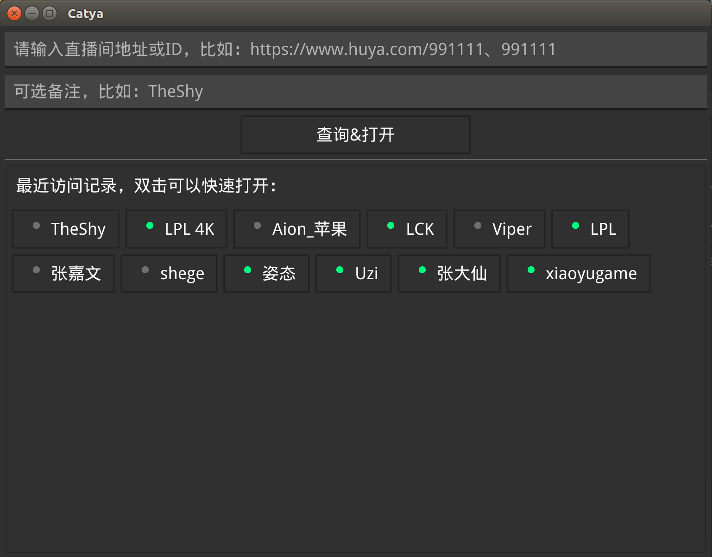
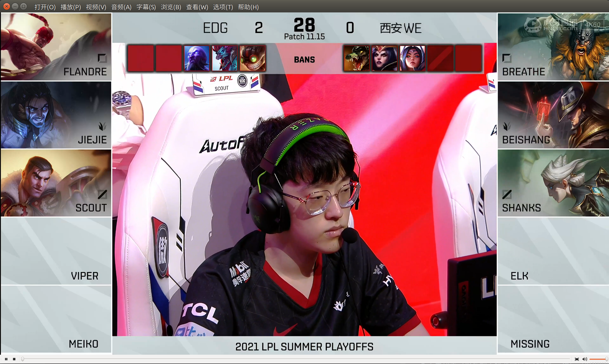

# Catya
有一说一，虎牙的4k 60fps直播源画质真高，个人觉得达到了YouTube 4k的水平，但是感觉在浏览器上面打开比较卡，很吃资源，于是，我写了这个工具抓取实际直播源地址，然后通过本地的网络播放器打开，效果非常好，贼流畅，也很简洁。

软件使用纯Go语言开发，UI这块使用了fyne这个开源图形库，这个库功能还挺强大的，基于opengl，基本的组件都有，拿来写一些不是非常复杂的界面还是可以滴。



## 用法

目前编译了Linux、Windows、Mac这几个平台的安装包，需要的可以从release页面下载安装，其它平台可以参考官方编译文档自行编译：https://developer.fyne.io/started/packaging

1. 复制虎牙直播间地址，或者直接输入直播间号，比如lpl，或者s4k，支持备注功能，方便记忆

2. 回车或者点击查询并打开

3.
如果你安装了SMPlayer、MPV的话，点击的时候自动打开直播，没安装的话就自己手动打开吧，现在很多视频播放软件都支持网络播放。请自行安装相关播放器，检测一下，命令行输入mpv、smplayer有反应那就可以，因为这个功能本质上就是调用Shell命令。

4. 最近历史记录按照访问次数排序，目前1分钟更新一次直播状态，左键点击打开直播间、右键删除记录。



> 推荐使用mpv播放器，Linux下可使用```sudo apt install mpv```命令安装，Mac下可以使用```brew install mpv```安装，其它系统自行解决。

## 备注
如果你觉得浏览器看4k比较占资源，同时不喜欢看弹幕撕逼带节奏的话，这个非常适合你，另外如果你是4k高分辨率屏幕，可能需要设置一下缩放，通过导入一个环境变量，比如我设置成1.75。
```
export FYNE_SCALE=1.75
```

最后，此软件只是本人兴趣爱好开发，献给爱看LOL直播、喜欢TheShy的玩家，如果有版权问题，侵权秒删，感谢支持！